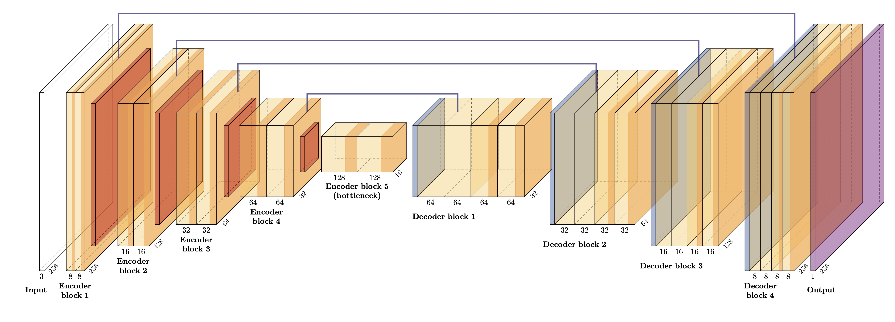

# Building Segmentation with U-Net

This repository implements semantic segmentation for automatically extracting building footprints from aerial images, sourced from [Minh (2013)](http://www.cs.toronto.edu/~vmnih/data/). The implementation uses the U-Net convolutional network architecture [(Ronneberger et al. 2015)](https://link.springer.com/chapter/10.1007/978-3-319-24574-4_28) to map input images to pixel-wise building/non-building predictions.

## Repository Structure

```
├── segmentation_homework.ipynb    # Main notebook with the implementation workflow
├── hw1_library/                   # Library with modular components
│   ├── nn_model/                  # Neural network model implementation
│   │   ├── architecture/          # U-Net architecture definition
│   │   ├── predict.py             # Prediction functionality
│   │   └── train_model.py         # Training routines
│   ├── utilities/                 # Utility functions
│   │   ├── download_data.py       # Data downloading
│   │   ├── load_model.py          # Model loading
│   │   ├── read_image_numpy.py    # Image reading utilities
│   │   └── save_model.py          # Model saving
│   └── visualizations/            # Visualization utilities
│       ├── display_image.py       # Basic image display
│       ├── visualize_predictions.py           # Prediction visualization
│       ├── visualize_segmentation_errors.py   # Error visualization
│       └── visualize_segmentation_errors_sample.py  # Sample error visualization
└── models/                        # Saved model weights and architecture parameters
```

## Dataset

The image dataset consists of 3,347 color images with dimensions 3×256×256, sourced from [Minh (2013)](http://www.cs.toronto.edu/~vmnih/data/). Each image corresponds to a 300-square-meter area within Massachusetts. The labels are building footprint vectors derived from [OpenStreetMap](https://www.openstreetmap.org/relation/61315), rasterized into binary masks.

## Model Architecture

The implementation uses a U-Net architecture with the following features:

- Encoder path with 5 levels (doubling channels at each level: 8→16→32→64→128)
- Decoder path with skip connections from the encoder
- Dropout regularization (p=0.1)
- Binary segmentation output (building vs. non-building)
- `BCEWithLogitsLoss` with class weighting to handle imbalance



## Training Details

- **Optimizer**: Adam with learning rate 1e-4
- **Loss Function**: `BCEWithLogitsLoss` with positive weighting to address class imbalance
- **Early Stopping**: Based on validation loss with patience of 10 epochs
- **Evaluation Metrics**: IoU (Intersection over Union), Precision, Recall, F1-score

## Key Features

1. **Complete Segmentation Pipeline**:
   - Data loading and preprocessing
   - Model definition and training
   - Prediction and evaluation
   - Result visualization

2. **Modular Implementation**:
   - Separation of model architecture, training routine, utilities, and visualizations
   - Easy experimentation with different hyperparameters

3. **Visualization Tools**:
   - Training progress (loss and IoU curves)
   - Segmentation predictions
   - Error analysis (TP, TN, FP, FN visualization)
   - Precision-recall curves for threshold tuning

4. **Class Imbalance Handling**:
   - Weighted loss function
   - Threshold optimization for balanced precision-recall
